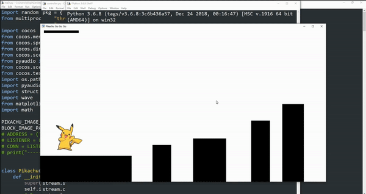
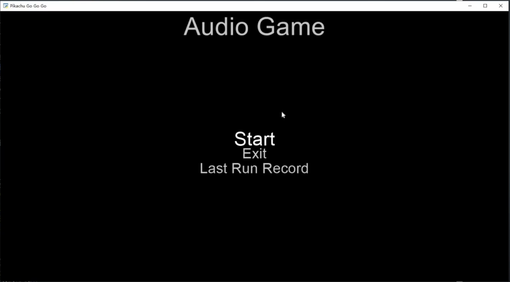
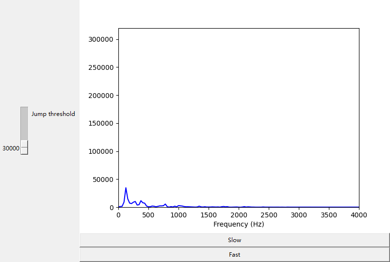
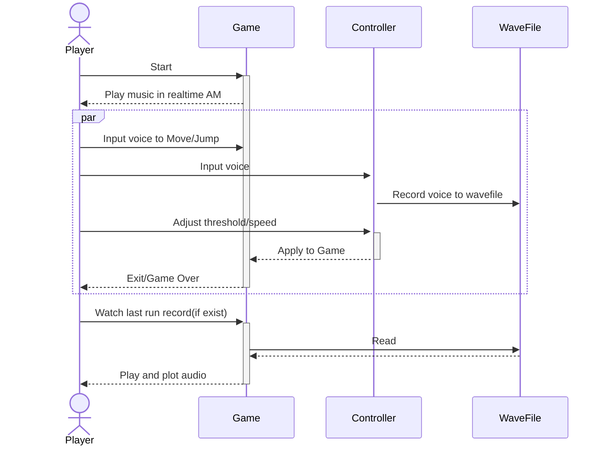

# Pikachu-Go
A voice controlled game developed by cocos2d, tkinter and PyAudio.


## Pre-requirements

---
```shell
$ python --version
Python 3.9.7
```
Install Packages
```shell
$ pip install -r requirements.txt
```
## Gameplay

---
The game has two interfaces, a game interface and a controller interface.

To start the game, open /pikachu-go and run the **main.py**. The main menu will be shown to the player.

```shell
$ python main.py
```



Click or press “Enter” on “Start”, a sound effect will be played, indicating that the game has been successfully started. The sound effect is applied amplitude modulation (AM) and processed in real time. **Please note that the game is not ready to play until the controller is ready.**

Then, open another terminal and run **controller.py**. The controller will be shown to the player and the game will automatically come into play.

```shell
$ python controller.py
```


This is a simple Mario game controlled by sound. Players make sound to control the Pikachu to move left or jump. There is a voice bar on the top of the game interface to visualize the current sound amplitude. The game will be over if the Pikachu falls down. 



The controller consists of 3 main parts. On the left of the interface is the jump threshold slide bar. Players can adjust the amplitude threshold to make the Pikachu jump using this slider. On the top-right is a graph plotting the live frequency spectrum of the player’s current sound. The two buttons below the graph are used for adjusting the horizontal speed of the Pikachu. The default speed is set to slow.

After the game is over, the game interface will return to the main menu. Players can click on “Last Run Record” to play the sound recording of the last run of the game. A pop-up window will also be shown to plot the sound in real time. Players can also click on “Exit” to close the game directly.


## Design Overview

---


Game: main.py <br>
Controller: controller.py <br>
WaveFile: output.wav <br>

## Core Features

---

- main.py
    - Sound effect with real time amplitude modulation (AM):
    When starting the game, players can hear a sound effect. This sound effect is processed by real time amplitude modulation (AM). The samples are read in block size of 4000 to avoid distortion caused by hardware.

    - Class MainMenu implemented the Menu [Scene](http://python.cocos2d.org/doc/api/cocos.scene.html).
    ```python
    class MainMenu(Menu):
        def __init__(self):
            ...
        # Start game
        def start(self):
            director.replace(SplitColsTransition(Scene(VCGame())))

        # Exit game
        def on_quit(self):
            director.window.close()

        # Watch Last Run Record
        def play_wav(self):
    ```

    - Class Pikachu implemented methods related to Pikachu's actions
    ```python
    class Pikachu(cocos.sprite.Sprite):
        def __init__(self, imagepath, **kwargs):
            super(Pikachu, self).__init__(imagepath)
            self.image_anchor = 0, 0
            # Reset
            self.reset(False)
            # Update
            self.schedule(self.update)

        def jump(self, h):
            if self.is_able_jump:
                self.y += 1
                self.speed -= max(min(h, 10), 7)
                self.is_able_jump = False

        def land(self, y):
            if self.y > y - 25:
                self.is_able_jump = True
                self.speed = 0
                self.y = y

        def update(self, dt):
            self.speed += 10 * dt
            self.y -= self.speed
            if self.y < -85:
                # End game, change Scene to MainMenu
                director.replace(SplitColsTransition(Scene(MainMenu())))

        def reset(self, flag=True):
            if flag: self.parent.reset()
            # Is able to jump or not
            self.is_able_jump = False
            # Speed
            self.speed = 0
            # Position
            self.position = 80, 280
    ```

    - Class Block defined ground/obstacles
    ```python
    class Block(cocos.sprite.Sprite):
        def __init__(self, imagepath, position, **kwargs):
            super(Block, self).__init__(imagepath)
            self.image_anchor = 0, 0
            x, y = position
            if x == 0:
                self.scale_x = 4.5
                self.scale_y = 1
            else:
                self.scale_x = 0.5 + random.random() * 1.5
                self.scale_y = min(max(y - 50 + random.random() * 100, 50), 300) / 100.0
                self.position = x + 50 + random.random() * 100, 0
    ```

    - Class VCGame implemented the game main process and listener to receive signal from controller.py using [Socket](https://docs.python.org/3/library/multiprocessing.html#module-multiprocessing.connection).
    ```python
    class VCGame(cocos.layer.ColorLayer):
        def __init__(self):
            ...
            self.address = ('localhost', 6000)
            self.listener = Listener(self.address, authkey=b'secret password')
            ...

        def collide(self):
            ...

        def update(self, dt):
            # Get volumn
            audio_data = self.stream.read(self.num_samples, exception_on_overflow=False)
            k = max(struct.unpack('1000h', audio_data))
            self.vbar.scale_x = k / 10000.0
            pkg = self.conn.recv()
            self.threshold = pkg.get("threshold", self.threshold)
            self.speed = pkg.get("speed", self.speed)
            if k > 3000:
                self.floor.x -= min((k / 20.0), 150) * dt * self.speed
            # Jump
            if k > self.threshold:
                self.pikachu.jump((k - 8000) / 1000.0)
            # Collision detect
            self.collide()
    ```

- controller.py
    - Real time game control GUI:<br>
    After running the controller, a game control GUI with multiple functions will be shown to the player. It is implemented using Tkinter. It consists of a slider, two buttons and a plotting of frequency spectrum. The slider is used for precise adjusting of amplitude threshold to make the Pikachu jump. The buttons are used for setting the horizontal speed of the Pikachu. Signals of all the slider and buttons are transmitted to the game interface by socket in real time. The plotting is the live frequency spectrum  (Fourier transform) of the current input sound. It is computed  using the FFT.

    - Recording of player voice and real time plotting: <br>
    After each game, the recording of the players’ voice will be saved to an output file. This is implemented in the control section. The main menu of the game has the option to replay the output file if there exists one. The file will also be plotted while it is playing in real time.
